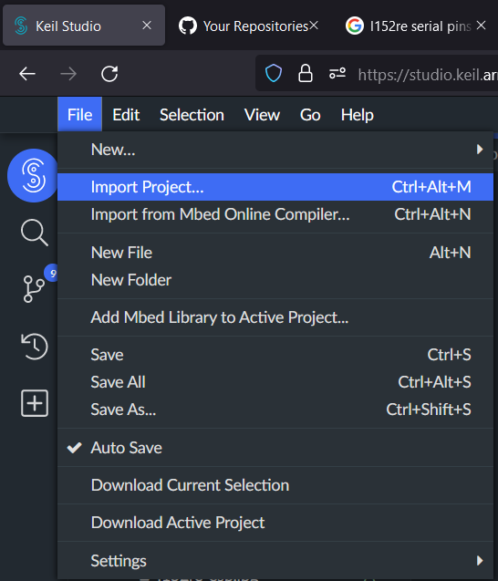
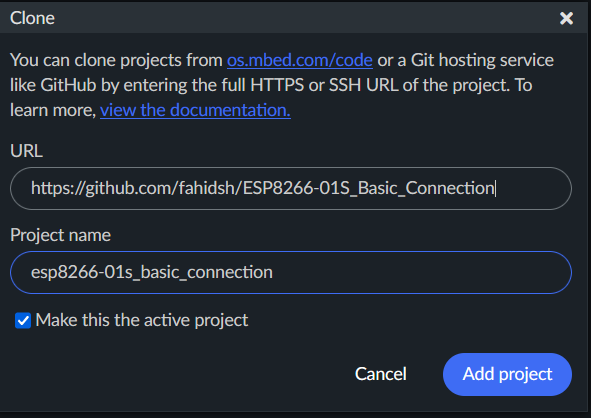
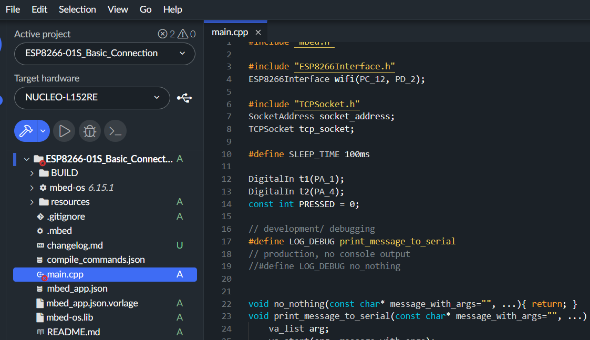
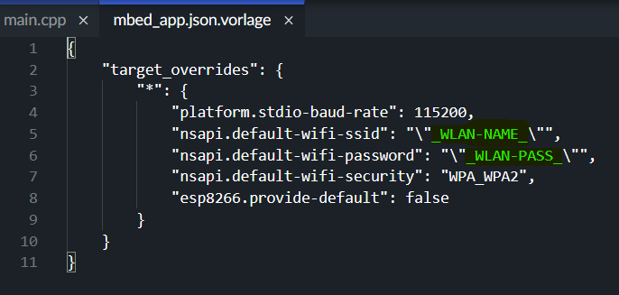
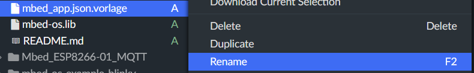
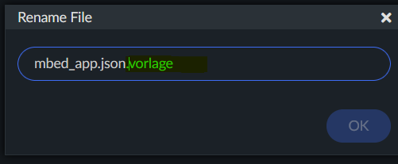
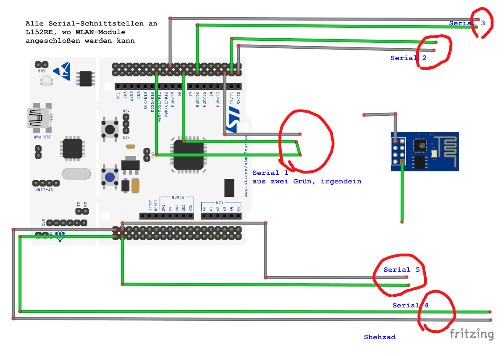
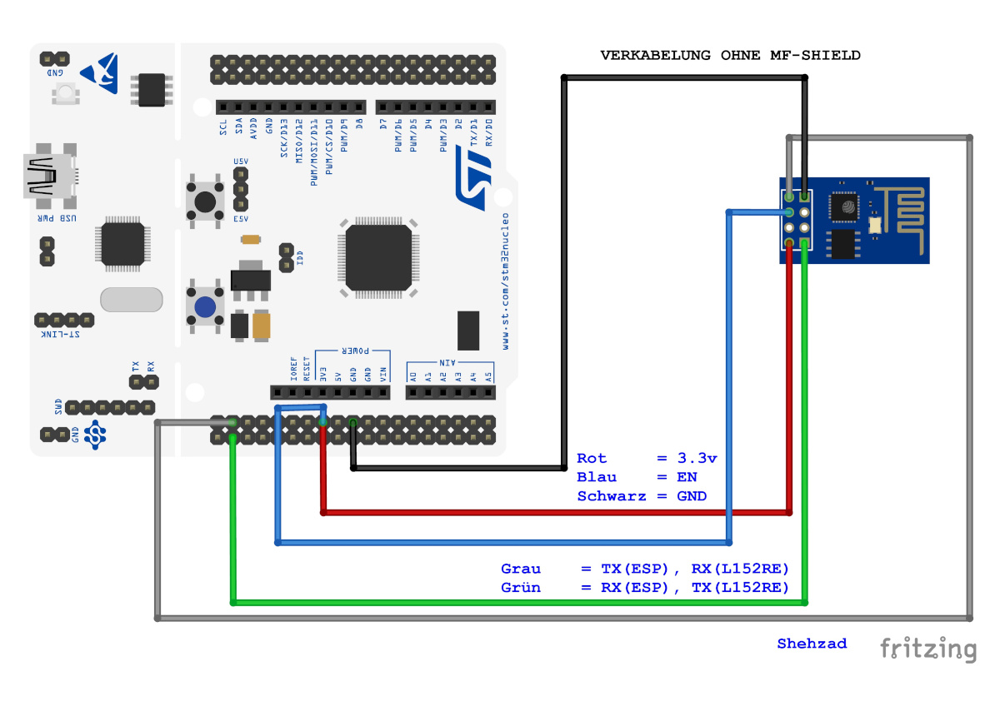
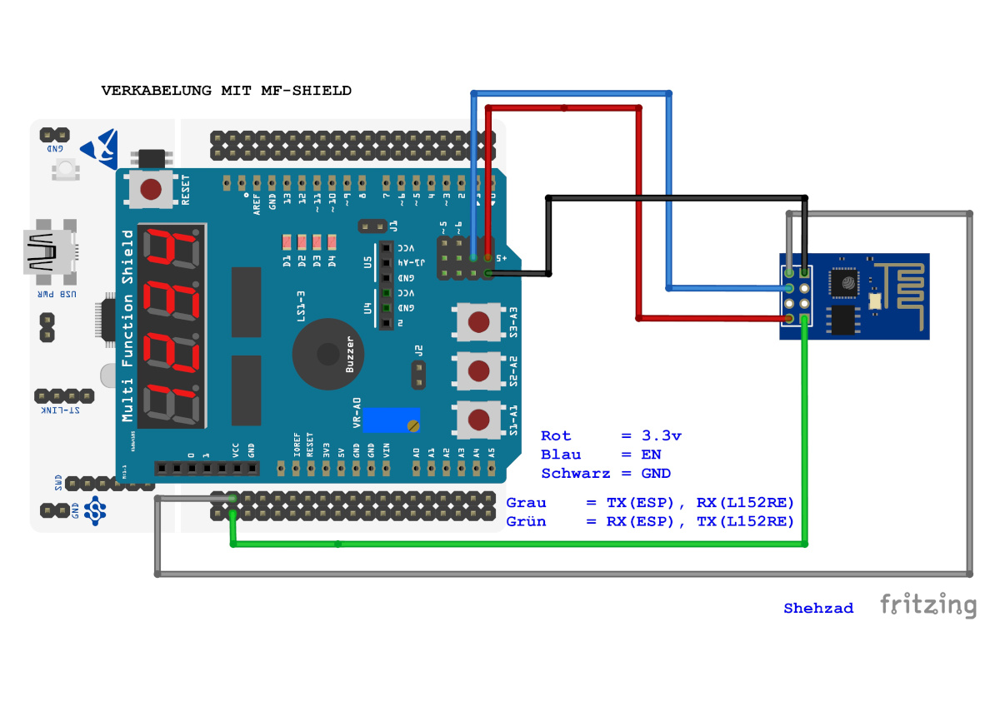

# ESP8266-01S Basic Connection Example
---
## Nutzung/ Tutorial
Es gibt mehrere Möglichkeiten wie man dieses Projekt benutzen kann, Einfachere wäre vielleicht mit Keil-Studio-Online

### Nutzung mit Keil-Studio-Online
1. Öffnen Sie Keil-Studio-Online (Anmelden)
2. Klicken Sie auf *File* Menu und wählen Sie *Import Project*

3. In geöffneten Fenster, fügen Sie den *Github-Repository URL* ein und Klicken Sie auf *Add Project*

Jetzt soll der Projekt von Github in Keil-Studio importiert werden und ähnlich wie folgendes aussehen

4. Öffnen Sie die Datei `mbed_app.json.vorlage` und tragen Sie (wo es Grün markiert ist) die WLAN-AP Name und Passwort ein

\_WLAN-NAME_ mit dem WLAN-AP Name ersetzen z.B. its-stuttgart

\_WLAN-PASS_ mit WLAN Passwort ersetzen z.B. passWorT123

nach Änderung soll es wie folgendes aussehen (mit Ihre WLAN-AP und Passwort)
```
{
    "target_overrides": {
        "*": {
            "platform.stdio-baud-rate": 115200,
            "nsapi.default-wifi-ssid": "\"its-stuttgart\"",
            "nsapi.default-wifi-password": "\"passWorT123\"",
            "nsapi.default-wifi-security": "WPA_WPA2",
            "esp8266.provide-default": false
        }
    }
}
```
Speichern Sie die Datei

5. Klicken Sie auf `mbed_app.json.vorlage` mit Rechte-Maus-Taste und wählen Sie *Rename*


6. Entfernen Sie den wort `.vorlage` am Ende der Datei-Name, die Datei soll nur `mbed_app.json` heißen.

7. Jetzt können Sie den Projekt Kompilieren und in Mikrocontroller hochladen und nutzen.


---
## Begrifflichkeiten

|Begriff| Bedeutet|
|-|-|
|WLAN-Module|ESP8266-01S|
|Mikrocontroller oder MC|NUCLEO L152RE|
|MF-Shield oder MFS|Arduino Multifunktion-Shield|
|SS#|Serielle Schnittstelle Nummer <br>_z.B. SS3 bedeutet Serielle Schnittstelle 3_|
---

## Nutzen von WLAN-Module mit Mbed-OS 
Mikrocontroller unterstützt WLAN-Verbindung durch WLAN-Module, dafür muss eine Serialle Schnittstelle auf Mikrokontroller verwendet werden. Mikrocontroller hat 5x Serialle Schnittstellen.

In Mbed-OS 5.X, musste man dafür extra die ESP8266-Bibleotheken importieren. In Mbed-OS 6.X sind die erforderliche Bibleotheken aber schon dabei und müssen nicht extra importiert werden. Es reicht nur eine Include-Anweisunf 
```
#include "ESP8266Interface.h"
```

---

## Serielle Schnittstellen an NUCLEO-L152RE
|SS#|TX_PIN|RX_PIN|Beschreibung/ Bemerkung|
|-|-|-|-|
|1|PA_6/9|PA_10|Benutzt bei MF-Shield, wenn verbunden|
|2|PA_2|PA_3|Benutzt bei MF-Shield, wenn verbunden|
|3|PB_10|PB_11|Benutzt bei Sturmboard für WLAN-Module, wenn verbunden|
|4|PC_10|PC_11|Kann verwendet werden um WLAN-Module ohne Sturmboard zu nutzen|
|5|PC_12|PD_2|Kann verwendet werden um WLAN-Module ohne Sturmboard zu nutzen|

### Alle Serial Pins von Mikrocontroller


## Initializierung von WLAN-Objekt
Um eine Objekt von WLAN-Module zu erstellen, nutzt man folgende Code: 

```
ESP8266Interface objekt_name(TX_PIN, RX_PIN);
```

Beispiel mit SS5:

```
ESP8266Interface wifi(PC_12, PD_2);
```

## WLAN-AP Name und Passwort
Der WLAN-AP Name, Passwort und Sicherheit-Typ wird in der Regel in eine getrennte Datei `mbed_app.json` gespeichert.

In der Projekt on Github ist eine Vorlage von dieses Datei als `mbed_app.json.vorlage` mitgeliefert. In die Datei muss der WLAN-AP und Passwort eingegeben sein und diese Datei soll dann als `mbed_app.json` umbennet werden.

## WLAN-Verbindungsstatus abrufen
Derzeitigen Status von WLAN-Verbindung kann abgerufen werden, in dem man auf dem WLAN-Objekt den `get_connection_status();` methode aufruft. Dieser Methode gibt eine `nsapi_connection_status` Wert zurück. Mögliche Werte und Bedeutungen finden Sie in die folgende Tabelle

|Rückgabe|Rückgabe Wert|Bedeutung (Shehzad)|Bedeutung (Offiziel)
|-|-|-|-|
|NSAPI_STATUS_LOCAL_UP|0|WLAN ist verbunden|local IP address set|
|NSAPI_STATUS_GLOBAL_UP|1|WLAN ist verbunden|global IP address set|
|NSAPI_STATUS_DISCONNECTED|2|WLAN ist nicht verbunden|no connection to network|
|NSAPI_STATUS_CONNECTING|3|versucht gerade die Verbindung herzustellen|connecting to network|
|NSAPI_STATUS_ERROR_UNSUPPORTED|-|oops ..., kein Ahnung|NSAPI_ERROR_UNSUPPORTED|

Beispiel
```
nsapi_connection_status wifi_status = wifi.get_connection_status();
if (wifi_status == NSAPI_STATUS_LOCAL_UP || wifi_status == NSAPI_STATUS_GLOBAL_UP) {
    // WLAN ist verbunden
} else{
    // WLAN ist nicht verbunden
}
```


---
## Debugging Nachrichten an Serielle-Konsole senden
Während des Development oder Debugging, ist es sehr Nutzlich die Status-Nachrichten an Serial-Konsol zu schicken.

Für diesem Zweck gibt die Möglichkeit folgende *Funktion* zu verwenden:
```
LOG_DEBUG("Die Meldung")
// oder 
LOG_DEBUG("Die Meldung mit parameters %s - %d", char_var, int_var);
```

### Warum soll man `LOG_DEBUG()` verwenden und nicht direkt `printf()`
Der `LOG_DEBUG` benutzt in Hintergrund schon das `printf()` function um eine Meldung an die Serielle-Konsole zu schicken. Es hat aber ein Vorteil, man kann steueren, was der `LOG_DEBUG()` genau macht.

z.B. es ist zwar gut, die Meldungen an Serielle-Konsole zu schicken, es kostet aber viel an die Resourcen [siehe Mbed-Doku](https://os.mbed.com/docs/mbed-os/v6.15/debug-test/debugging-using-printf-statements.html)

Daher man kann die `printf()` in development und/oder debugging verwenden aber in Produktion-Version dieses ausschalten.

Während des soll der Code-Block so aussehen
```
// development/ debugging
#define LOG_DEBUG print_message_to_serial
// production, no console output
//#define LOG_DEBUG no_nothing
```
und in the Produktion, man kann den Code-Block wie folgendes ändern
Während des soll der Code-Block so aussehen
```
// development/ debugging
//#define LOG_DEBUG print_message_to_serial
// production, no console output
#define LOG_DEBUG no_nothing
```

Nur durch diese kleine Änderung werden alle `LOG_DEBUGG()` Aufrufe nichts tun und dadurch werden die Mikrocontroller Resourcen gespart.

---
 
## Taster-Poling anstatt Interupts
Interupts (InteruptIn) sind gut aber nicht überall nutzbar, die Interupts kann man nicht mit methoden binden, die etwas Resource-Intensive machen. Und für WLAN-Verbindung herstellung werden die Resourcen verwendet. Daher sind hier die Interupts nicht nutzbar.


## WLAN-Module an Mikrocontroller anschließen
Der WLAN Module braucht mindestens 5 Kabeln verbunden mit Mikrocontroller um richtig funktionieren zu können.

|von ESP8266 Pin|zu L152RE Pin|Beschreibung|
|-|-|-|
|3V3/3.3v|3.3v|liefert Strom zu WLAN-Module|
|TX|RX|Transmission/Data-Sende-Pin von WLAN-Module|
|EN|3.3v|Enable/Einschalten, muss auch an 3.3v Pin angeschloßen sein|
|RX|TX|Receive/Data-Empfang-Pin von WLAN-Module|
|GND|GND|Grund-Kabel von WLAN-Module|

### Verkabelung ohne MF-Shield, direkt an Mikrocontroller


### Verkabelung mit MF-Shield (nur ITS-Stuttgart)
<span style="color:red; font-weight:bold">ACHTUNG: Diese Verkabelung ist nur für ITS-Stuttgart, wo Herr Kohler die MF-Shield für nur 3.3v Strom Ausgabe konfiguriert hat. Normallerweis liefert MF-Shield hier 5v, Anschließen von ESP8266-01S an 5v kann den ESP8266-01S permanent schaden.</span>



